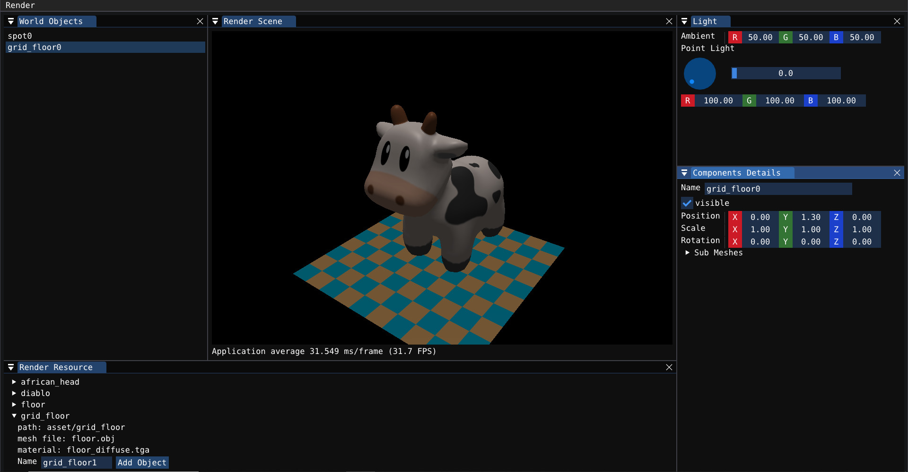
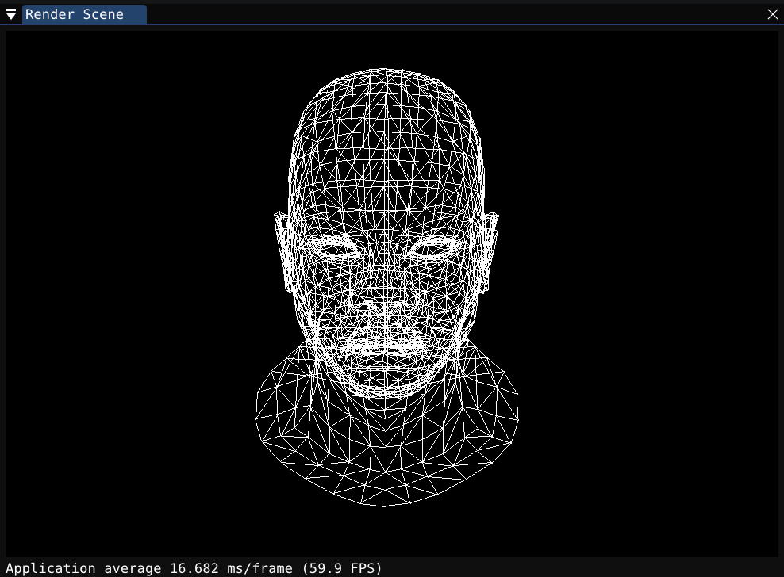
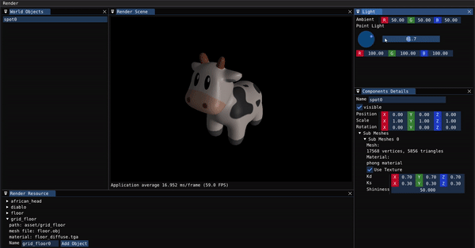
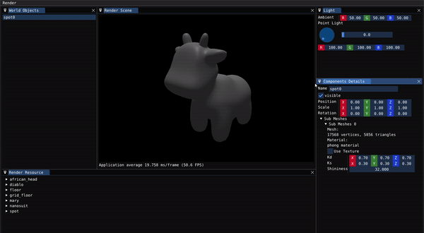
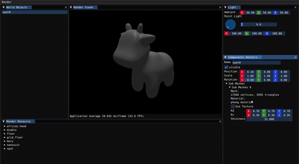

# Chaotirender
Chaotirender is a tiny render engine written in C++(yet too simple to be an engine). The project mainly contains three parts:
- A **CPU software rasterization pipeline** with programmable shader written from scratch.
- A **render system** with scene and asset manager built upon the render pipeline.
- An **editor** with first person view camera which allows for material/scene editing.

## Features
- Supports triangle and line primitives
- Programmable shader
- Frustum culling and homogeneous clipping
- Back face culling
- Early Z testing
- Perspective corrected interpolation
- Nearest and bilinear texture sampling
- Blinn-Phong material
- CPU parallel acceleration
- Apply transformation to objects

## Sceenshots

## 3rd Party Dependencies
The project uses these 3rd party dependencies:
- [GLM](https://github.com/g-truc/glm) math library
- [ImGui](https://github.com/ocornut/imgui) for GUI
- [GLAD](https://github.com/Dav1dde/glad) and [GLFW](https://github.com/glfw/glfw) for ImGui OpenGL backends
- [stb](https://github.com/nothings/stb) image libray for loading texture
- [tinyobjloader](https://github.com/tinyobjloader/tinyobjloader) for loading models

## References
- Real-Time Rendering 4th Edition
- [Piccolo](https://github.com/BoomingTech/Piccolo) engine
- [LearnOpenGL](https://learnopengl.com/)

